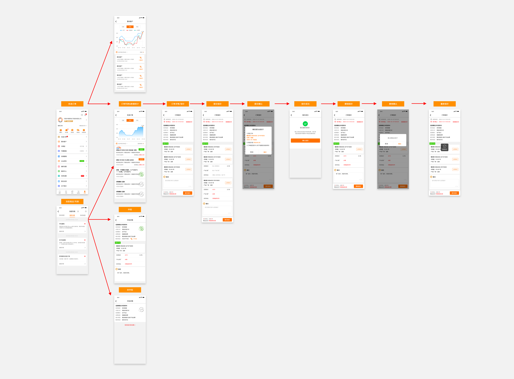

钢速卖新增功能所需接口

## 文档目录

* 中钢网App钢速卖新增功能设计图
* 接口列表
* 接口详情


## 1.中钢网App钢速卖新增功能设计图

(设计图已修改,下图未变动)



## 2.接口列表

- 优选订单

  - [获取优选订单列表](###3.1 获取优选订单列表)
    - [获取优选订单详情](###3.2 获取优选订单详情)
    - [提交订单报价](###3.3 提交订单报价)
    - [撤销报价](###3.4 撤销报价)
  -   [获取走势图请求类别列表 ](###3.5 获取走势图请求类别列表 )
  -   [获取优选订单数据统计列表](###3.6 获取优选订单数据统计列表)

- 意向客户

  - [获取意向客户列表](###3.7 获取意向客户列表)
- [获取优选客户数据统计列表](###3.8 获取优选客户数据统计列表)
  
- 消息推送

  - [~~获取消息详情~~](###~~3.9 获取消息详情~~)

  - [~~关闭消息~~](###~~4.0 关闭消息(待定,后期再说)~~)  


## 3.接口详情

### 3.1 获取优选订单列表

####3.1.1接口地址

```url
(GET)
api/GsmProduct/getHighQualityOrderList
```

#### 3.1.2 请求参数

| 参数名称  | 参数类型 | 描述                      |
| --------- | -------- | ------------------------- |
| memberId  | int      | 用户ID                    |
| epId      | int      | 公司ID                    |
| date      | date     | 选择查询时间              |
| sort      | int      | 按时间排序(0-升序 1-降序) |
| pageIndex | int      | 页码                      |
| pageSize  | int      | 条数                      |

#### 3.1.3 响应参数

| 参数名称    | 参数类型 | 描述                                                   |
| ----------- | -------- | ------------------------------------------------------ |
| title       | String   | 标题                                                   |
| content     | String   | 内容                                                   |
| companyType | int      | 公司类型(0-自营店铺 1-其他店铺)                        |
| endTime     | long     | 截止时间(时间戳)                                       |
| dateTime    | date     | 发布日期时间                                           |
| orderId     | int      | 订单ID                                                 |
| orderStatus | int      | 订单状态(0-待报价 1-比价中 2-已中标 3-未中标 4-已截止) |

#### 3.1.4 响应示例

```json
{
  "statuscode": 200,
  "result": 0,
  "msg": "获取成功",
  "data": [
     	 {  
            "orderId":10077673882,
      		"title":"求购 螺纹 亚新",
  			"content":"收货地在郑州丨需报含税价丨增值税专用发票",
            "companyType":0,
            "endTime":1998756237242387,
      		"dateTime":"2021年02月16日 13:28",
      		"orderStatus":0
  		  } ,
          {
            "orderId":10077673882,
      		"title":"求购 螺纹 亚新",
  			"content":"收货地在郑州丨需报含税价丨增值税专用发票",
            "companyType":0,
            "endTime":1998756237242387,
      		"dateTime":"2021年02月16日 13:28",
      		"orderStatus":0
  		  } 
      ]
}
```

---

### 3.2 获取优选订单详情

####3.2.1接口地址

```url
(GET)
api/GsmProduct/getHighQualityOrderDetail
```

#### 3.2.2 请求参数

| 参数名称 | 参数类型 | 描述   |
| -------- | -------- | ------ |
| memberId | int      | 用户ID |
| epId     | int      | 公司ID |
| orderId  | int      | 订单ID |

#### 3.2.3 响应参数

| 参数名称           | 参数类型 | 描述                                                   |
| ------------------ | -------- | ------------------------------------------------------ |
| endTime            | long     | 报价截止时间(时间戳)                                   |
| orderStatus        | int      | 订单状态(0-带报价,1-比价中,2-已中标,3-未中标,4-已截止) |
| quoteNum           | int      | 报价人数                                               |
| shippingAddress    | String   | 收货地区                                               |
| deliveryDate       | String   | 交货日期                                               |
| transactionType    | int      | 交易类型(0,1,2-其他交易方式)                           |
| businessType       | int      | 经营模式(0,1,2-生产加工)                               |
| invoiceInfo        | String   | 发票信息                                               |
| buyer              | String   | 采购商                                                 |
| buyerPhone         | String   | 采购商电话                                             |
| quoteType          | String   | 报价类型                                               |
| fareType           | int      | 运费类型(0-一票到,1-出厂价)                            |
| remark             | String   | 备注                                                   |
| productList        | array    | 报价商品列表                                           |
| * productID        | int      | 产品ID                                                 |
| * productName      | String   | 产品名称                                               |
| * purchaseQuantity | String   | 采购量                                                 |
| * manufacturer     | String   | 产地/厂家                                              |
| * senderAddress    | String   | 发货地                                                 |
| * quotePrice       | double   | 报价金额                                               |
| * farePrice        | double   | 运费金额                                               |

#### 3.2.4 响应示例

```json
{
  "statuscode": 200,
  "result": 0,
  "msg": "获取成功",
  "data": {
      "endTime":1987667545902580,
      "quoteNum":8,
      "shippingAddress":"郑州库提",
      "deliveryDate":"下单后3天内交货至采购商收货地",
      "transactionType":"其他交易方式",
      "businessType":"生产加工",
      "invoiceInfo":"增值税专用发票",
      "quoteType":"含税报价",
      "fareType":0,
      "productList":[
     	  {
            "productID":1002999,
      		"productName":"螺纹钢 HRB400E 22*12*12000",
  			"purchaseQuantity":"10.0000吨",
      		"manufacturer":"亚新",
            "senderAddress":"河南省郑州市",
            "quotePrice":4000.00,
            "farePrice":500.00
  			} ,
          {
      		"productName":"螺纹钢 HRB400E 22*12*12000",
  			"purchaseQuantity":"10.0000吨",
      		"manufacturer":"亚新",
      		"quotePrice":"4070",
            "senderAddress":"河南省郑州市",
            "quotePrice":4000.00,
            "farePrice":500.00
  			}      
      ]
}
```

---

###3.3 提交订单报价

#### 		3.3.1 请求地址

```url
(POST)
api/GsmProduct/updatQuoteInfo
```

#### 3.3.2 请求参数

| 参数名称        | 参数类型 | 描述         |
| --------------- | -------- | ------------ |
| memberId        | int      | 用户ID       |
| epId            | int      | 企业ID       |
| orderId         | int      | 订单ID       |
| remark          | String   | 备注         |
| quoteProductNum | int      | 报价商品条数 |
| quoteList       | array    | 报价商品列表 |
| * productID     | int      | 报价商品ID   |
| * senderAddress | String   | 发货地址     |
| * quotePrice    | String   | 报价金额     |
| * farePrice     | String   | 运费         |

#### 3.3.3 响应参数

| 参数名称   | 参数类型 | 描述   |
| ---------- | -------- | ------ |
| statuscode | int      | 状态码 |
| result     | int      | 结果码 |
| msg        | String   | 消息   |

####3.3.4 响应示例

```json
{
  "statuscode": 200,
  "result": 0,
  "msg": "提交成功"
}
```

---

### 	3.4 撤销报价

#### 		3.4.1 请求地址

```url
(GET)
api/GsmProduct/revokeQuotation
```

#### 3.4.2 请求参数

| 参数名称 | 参数类型 | 描述   |
| -------- | -------- | ------ |
| memberId | int      | 用户ID |
| epId     | int      | 公司ID |
| orderId  | int      | 订单ID |

#### 3.4.3 响应参数

| 参数名称   | 参数类型 | 描述   |
| ---------- | -------- | ------ |
| statuscode | int      | 状态码 |
| result     | int      | 结果码 |
| msg        | String   | 消息   |

####3.4.4 响应示例

```json
{
  "statuscode": 200,
  "result": 0,
  "msg": "撤销成功"
}
```

---

### 	3.5 获取走势图请求类别列表

#### 		3.5.1 请求地址

```url
(GET)
api/GsmProduct/getTrendTypeList
```

#### 3.5.2 请求参数

| 参数名称 | 参数类型 | 描述   |
| -------- | -------- | ------ |
| memberId | int      | 用户ID |

#### 3.5.3 响应参数

| 参数名称        | 参数类型 | 描述         |
| --------------- | -------- | ------------ |
| statuscode      | int      | 状态码       |
| result          | int      | 结果码       |
| msg             | String   | 消息         |
| data            | array    | 趋势类型列表 |
| * trendTypeId   | int      | 趋势类型ID   |
| * trendTypeDesc | String   | 趋势类型描述 |

####3.5.4 响应示例

```json
{
  "statuscode": 200,
  "result": 0,
  "msg": "获取成功"
  "data":[
    	{
    		"trendTypeID":1001,
    		"trendTypeDesc":"近7日"
		},
		{
    		"trendTypeID":1002,
    		"trendTypeDesc":"近14日"
		},
		{
    		"trendTypeID":1003,
    		"trendTypeDesc":"近30日"
		}
    ]
}
```


### 3.6 获取优选订单数据统计列表

#### 		3.6.1请求地址

```html
(GET)
api/UserCenter/getHigtQualityChart
```

#### 3.6.2 请求参数

| 参数名称    | 参数类型 | 描述       |
| ----------- | -------- | ---------- |
| memberId    | int      | 用户ID     |
| trendTypeId | int      | 趋势类型ID |

#### 3.6.3 响应参数

| 参数名称 | 参数类型 | 描述        |
| -------- | -------- | ----------- |
| date     | date     | 日期(月-日) |
| Views    | int      | 浏览量      |
| partName | String   | 详细描述    |

#### 3.6.4 响应示例

```json
{
  "statuscode": 200,
  "result": 1,
  "msg": "获取信息成功",
  "data": [
     {
        "date": "04-09",
        "Views": 100,
        "partName": "今日浏览量100人"       
 	 },
      {
        "date": "04-09",
        "Views": 100,
        "partName": "今日浏览量100人"       
 	 },
      {
        "date": "04-09",
        "Views": 100,
        "partName": "今日浏览量100人"       
 	 },
      {
        "date": "04-09",
        "Views": 100,
        "partName": "今日浏览量100人"       
 	 }
  ]
}
```

---

###3.7 获取意向客户列表

#### 		3.7.1 请求地址

```html
(GET)
api/UserCenter/getPotentialCustomerList
```

#### 3.7.2 请求参数

| 参数名称  | 参数类型 | 描述                      |
| --------- | -------- | ------------------------- |
| memberId  | int      | 用户ID                    |
| epId      | int      | 公司ID                    |
| date      | date     | 选择查询时间              |
| sort      | int      | 按时间排序(0-升序 1-降序) |
| pageIndex | int      | 页码                      |
| pageSize  | int      | 条数                      |

#### 3.7.3 响应参数

| 参数名称 | 参数类型 | 描述     |
| -------- | -------- | -------- |
| title    | String   | 标题     |
| content  | String   | 内容     |
| phone    | int      | 电话     |
| dateTime | date     | 日期时间 |

#### 3.7.4 响应示例

```json
{
  "statuscode": 200,
  "result": 0,
  "msg": "获取成功",
  "data": [
     	 {
      		"title":"意向客户",
  			"content":"XXX有订货需求,期待与您进一步沟通",
      		"dateTime":"2021年02月16日 13:28",
      		"phone":"15639700000"
  		  } ,
          {
      		"title":"意向客户",
  			"content":"XXX有订货需求,期待与您进一步沟通",
      		"dateTime":"2021年02月16日 13:28",
      		"phone":"15639700000"
  		  } ,
              
      ]
}
```

---

### 3.8 获取优选客户数据统计列表

#### 		3.8.1请求地址

```html
(GET)
api/UserCenter/getHigtQualityCustomerChart
```

#### 3.8.2 请求参数

| 参数名称    | 参数类型 | 描述       |
| ----------- | -------- | ---------- |
| memberId    | int      | 用户ID     |
| trendTypeId | int      | 趋势类型ID |

#### 3.8.3 响应参数

| 参数名称 | 参数类型 | 描述         |
| -------- | -------- | ------------ |
| date     | date     | 日期(月-日)  |
| appViews | int      | 移动端浏览量 |
| wxViews  | int      | 小程序浏览量 |
| pcViews  | int      | PC浏览量     |
| partName | String   | 详细描述     |

#### 3.8.4 响应示例

```json
{
  "statuscode": 200,
  "result": 1,
  "msg": "获取信息成功",
  "data": [
     {
        "date": "04-09",
        "appViews": 100,
        "wxViews": 100,
        "pcViews":100,
 	 },
      {
        "date": "04-09",
        "appViews": 100,
        "wxViews": 100,
        "pcViews":100,
 	 },
      {
        "date": "04-09",
        "appViews": 100,
        "wxViews": 100,
        "pcViews":100,
 	 },
      {
        "date": "04-09",
        "appViews": 100,
        "wxViews": 100,
        "pcViews":100,
 	 },
      {
        "date": "04-09",
        "appViews": 100,
        "wxViews": 100,
        "pcViews":100,
 	 }
  ]
}
```

---

### ~~3.9 获取消息详情~~

> **该接口可与获取优选订单详情接口通用无需关注**

#### 		3.9.1 请求地址

```url
(POST)
api/UserCenter/GetMessageDetail
```

#### 3.9.2 请求参数

| 参数名称    | 参数类型 | 描述                                                       |
| ----------- | -------- | ---------------------------------------------------------- |
| memberId    | int      | 用户ID                                                     |
| messageId   | int      | 消息ID                                                     |
| messageType | int      | 消息类型1-系统消息(1138)，2-中钢公告(82134)，3-私信(77293) |

#### 3.9.3 响应参数

| 参数名称           | 参数类型 | 描述                                |
| ------------------ | -------- | ----------------------------------- |
| messageId          | int      | 消息ID                              |
| orderId            | int      | 订单ID                              |
| orderStatus        | int      | 订单状态(0-未中标,1-已中标,2-other) |
| buyer              | String   | 采购商                              |
| quotePriceRank     | String   | 报价排名                            |
| amountPrice        | String   | 总价                                |
| messgaeTitle       | String   | 消息标题                            |
| shippingAddress    | String   | 收货地区                            |
| fareType           | int      | 运费类型(0-一票到,1-出厂价)         |
| transactionType    | int      | 交易类型(0,1,2-其他交易方式)        |
| businessType       | int      | 经营模式(0,1,2-生产加工)            |
| invoiceInfo        | String   | 发票信息                            |
| quotedpriceType    | String   | 报价类型                            |
| contactMobile      | String   | 联系电话                            |
| remark             | String   | 备注                                |
| productList        | array    | 产品详情                            |
| * productName      | String   | 产品名称                            |
| * purchaseQuantity | String   | 采购量                              |
| * manufacturer     | String   | 产地/厂家                           |
| * quotePrice       | int      | 报价                                |
| * seller           | String   | 报价厂家                            |
| * senderAddress    | String   | 发货地址                            |
| * fare             | String   | 运费                                |

####3.9.4 响应示例

``` json
{
  "statuscode": 200,
  "result": 0,
  "msg": "获取成功",
  "data": {
      "messageId":10086,
      "orderId":10001001,
      "orderStatus":0,
      "buyer":"采购商名称",
      "quotePriceRank":"您的报价排名第二",
      "amountPrice":"1000.00",
      "messgaeTitle":"亚新螺纹2车到郑州",
      "shippingAddress":"郑州库提",
      "transactionType":2,
      "businessType":2,
      "invoiceInfo":"增值税发票",
      "quotedpriceType":"需含税报价,报价不含运费",
      "contactMobile":"15639300222",
      "remark":"钢厂直供,质保价真",
      "productList":[
     	  {
      		"productName":"螺纹钢 HRB400E 22*12*12000",
  			"purchaseQuantity":"10.0000吨",
      		"manufacturer":"亚新",
      		"quotePrice":"4070",
      		"seller":"永钢",
      		"senderAddress":"河南省郑州市",
            "fare":"500"
  			} ,
          {
      		"productName":"螺纹钢 HRB400E 22*12*12000",
  			"purchaseQuantity":"10.0000吨",
      		"manufacturer":"亚新",
      		"quotePrice":"4070",
      		"seller":"永钢",
      		"senderAddress":"河南省郑州市",
            "fare":"500"
  			}      
      ]
}
```

------

### 	~~4.0 关闭消息(待定,后期再说)~~

#### 		4.0.1 请求地址

```url
(GET)
api/UserCenter/closePushMessage
```

#### 4.0.2 请求参数

| 参数名称 | 参数类型 | 描述   |
| -------- | -------- | ------ |
| memberId | int      | 用户ID |

#### 4.0.3 响应参数

| 参数名称   | 参数类型 | 描述   |
| ---------- | -------- | ------ |
| statuscode | int      | 状态码 |
| result     | int      | 结果码 |
| msg        | String   | 消息   |

####4.0.4 响应示例

``` json
{
  "statuscode": 200,
  "result": 0,
  "msg": "关闭成功"
}
```

---

